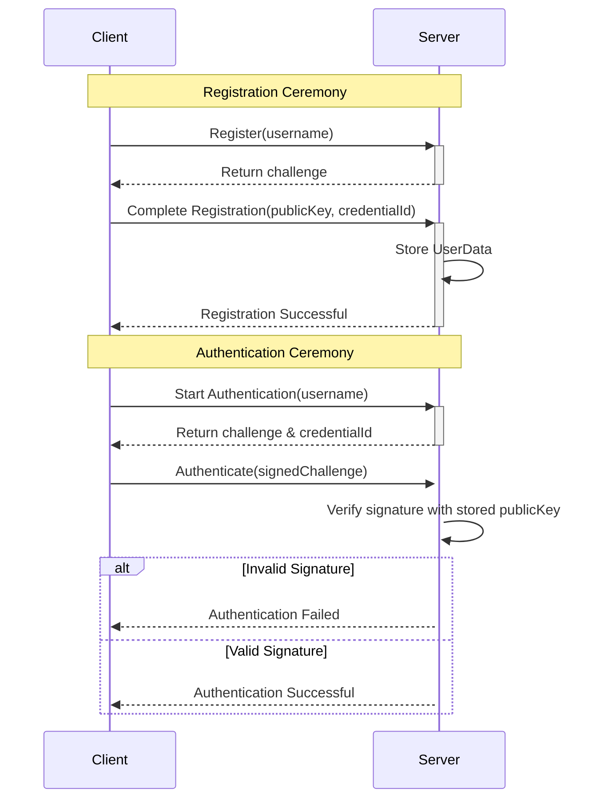

# Passwordless Authentication with Passkeys


This is a simple web server that demonstrates the use of the WebAuthn API. It provides a simple web page that allows users to register and authenticate using a Passkey.
## Demo


## Brief Overview

### 🔑 Registration Ceremony
- The server generates and stores a random challenge to prevent replay attacks
- Client provides public key and credential ID, which are stored securely in the userStore

### ✅ Authentication Ceremony
- Server issues a fresh challenge for each authentication attempt
- Client must provide:
   - Original challenge (prevents replay attacks)
   - Signed challenge (proves possession of private key)
   - Client data JSON (determine the current state or flow of the WebAuthn ceremony)
   - Authenticator data (cryptographic metadata)
- Server verifies the signature using the stored public key and combined authenticator/client data



## Building & Running

To build or run the project, use one of the following tasks:

| Task                          | Description                                                          |
|-------------------------------|----------------------------------------------------------------------|
| `./gradlew test`              | Run the tests                                                        |
| `./gradlew build`             | Build everything                                                     |
| `buildFatJar`                 | Build an executable JAR of the server with all dependencies included |
| `buildImage`                  | Build the docker image to use with the fat JAR                       |
| `publishImageToLocalRegistry` | Publish the docker image locally                                     |
| `run`                         | Run the server                                                       |
| `runDocker`                   | Run using the local docker image                                     |

If the server starts successfully, you'll see the following output:

```
2024-12-04 14:32:45.584 [main] INFO  Application - Application started in 0.303 seconds.
2024-12-04 14:32:45.682 [main] INFO  Application - Responding at http://0.0.0.0:8080
```


